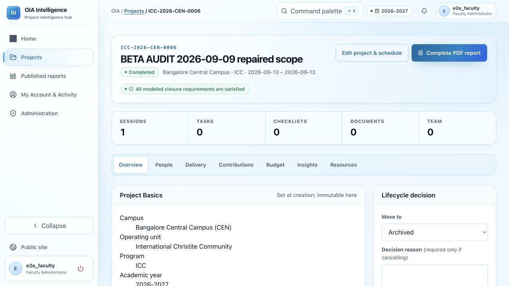
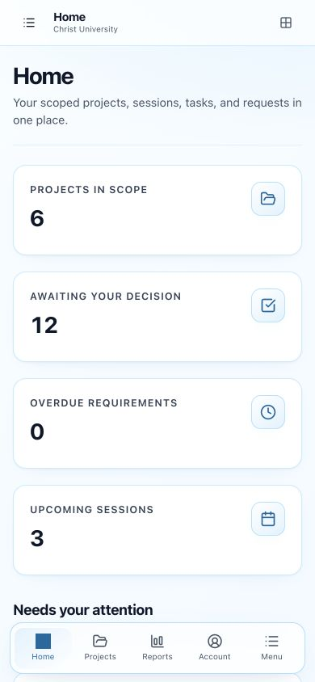
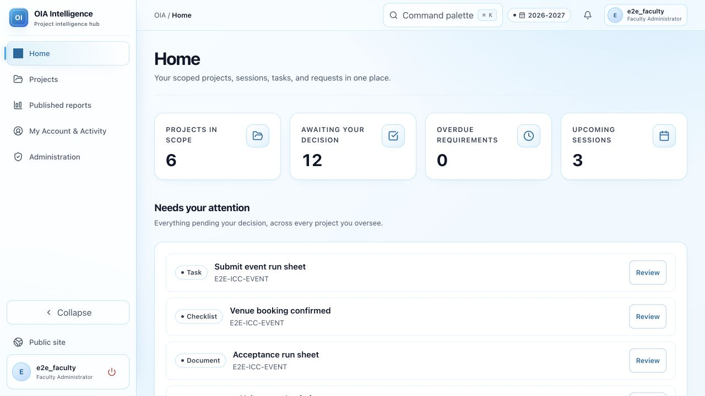

# ICC / IGP beta readiness audit

**Tested:** 8–9 September 2026, production at https://icc-platform-2.vercel.app/ plus an isolated local SQLite acceptance environment.

**Release assessment:** do not yet treat the application as ready for a beta that includes document uploads. Production currently reports successful uploads without storing the files. Core project and operational workflows are substantially improved by the fixes deployed during this audit, but itinerary times also need correction before users rely on the schedule.

Security hardening and stronger login requirements were excluded as requested. Findings below concern functionality, reliability, data correctness, and usability.

## 1. Blockers fixed during the audit

| ID | Severity | Reproduction and impact | Fix and verification |
|---|---|---|---|
| B01 | P0 | After ordinary sequential browser use, login and logout returned HTTP 500. Vercel logs reported Supabase `EMAXCONNSESSION`, maximum 15 session clients, and local SQLAlchemy pool timeouts. Static SVG requests also loaded the signed-in user from the database. | Static assets/liveness checks now skip the account query; Vercel instances use SQLAlchemy `NullPool` so frozen instances do not retain idle sessions. Deployed. Production login/logout, Events Head, faculty, and volunteer navigation pass afterward; icons render again. A subsequent 30-minute production 500-log query returned no entries. This is recovery evidence, not a 10-user load test. |
| B02 | P1 | Events Head → Projects → New → Create manually → ICC created a record, then returned Access denied. The created record had no Events wing and disappeared from that user's scope. | New projects inherit a compatible active creation assignment, including wing/campus/year. Scope is validated before insertion. Deployed and verified by creating `ICC-2026-CEN-0006` as Events Head and reopening it with wing Events. The earlier orphan test record is not automatically repaired. |
| B03 | P1 | Public overview and reports returned HTTP 500. The local site worked. Vercel's Python packaging excludes paths matching `**/public/**`, which omitted the Jinja public templates. | Moved templates to `app/templates/public_site` and updated template references; public URLs remain the same. Deployed. Production overview, empty reports/calendar, populated event calendar, event detail, and withdrawal all pass. |
| B04 | P1 | A manually created project's workspace had no browser entry point to edit its basics or create sessions. The setup wizard existed only at a separate URL. | Added **Edit project & schedule** for project managers. Deployed. Production venue/description edit and session creation pass through that link. |
| B05 | P1 | Approving an operational request moved it into a read-only settled table. Its existing **Mark completed** action could never be reached. | Only Completed/Cancelled requests are settled. Approved requests remain actionable. Deployed. The synthetic request was submitted by Events Head, approved by faculty, then marked Completed by Events Head; the final settled row shows Completed. |
| B06 | P2 | An uploaded PDF acquired category `None (Legacy value)` instead of an inferred category. Redis serialized absent optional metadata as the literal string `None`. | Serialize optional values as empty strings and accept legacy `None` values on completion. Deployed; Redis-backed regression test passes. A real persisted-file round trip is still blocked by B08 below. |
| B07 | P1 | A new project progressed Planned → Active → Closing, but Completed failed with `Project has 1 unresolved closure blocker(s)`. The missing item was Closure summary, and no browser form could write it. | Added a labeled closure-summary form beside the lifecycle controls, with version checking and an audit record. Targeted tests verify saving the summary unblocks completion and stale saves do not overwrite it. Deployed and verified in production: summary saved, zero remaining blockers, then Completed. |

Implementation: `app/__init__.py`, `app/config.py`, `app/services/project_quickcreate.py`, `app/services/upload_sessions.py`, `app/blueprints/erp.py`, `app/blueprints/public.py`, `app/templates/erp/project_detail.html`, and `app/templates/public_site/`.

## 2. Outstanding issues to fix before or during beta

### B08 — P1: uploads falsely report durable storage

**Steps:** Events Head → Acceptance ICC event → Resources → upload `BETA-AUDIT-report.pdf` → open the resulting Drive reference.

**Actual:** the app said `1 document(s) uploaded to Drive and indexed`, and the record showed Available/Indexed. The link contained `mock-97fd23347fb23a1b2d8cee0e`; Google Drive reported the file did not exist. The mock implementation returns a fabricated identifier and never persists the supplied bytes. This is a data-loss issue, independent of login security.

**Required:** configure a usable live storage identity and destination, switch Drive validation to live mode, then test upload → reload → open/download → compare content → include in report. The production environment has no `GOOGLE_DRIVE_REPOSITORY_ROOT_ID`. Credential values pulled through Vercel were redacted, so their validity could not be checked. A destination folder and service-account access were requested from the owner. Merely changing the mode without verifying credentials/folder access would replace false success with an upload failure.

**Acceptance:** a unique PDF and image uploaded in separate sessions remain readable after logout/login and a fresh server invocation. Failed uploads must show an error and must not create an Available record. Review the provider's shared-drive options in folder/file creation when using a shared drive. Existing `mock-*` records are test metadata, not recoverable documents; originals must be uploaded again.

### B09 — P1: imported itinerary times differ by 5½ hours

**Steps:** IGP Head → New project → Create IGP from itinerary → upload `BETA-AUDIT-itinerary.csv` from this directory.

**Expected:** 13 September 09:00–10:00 and 14 September 10:00–11:00, India time.

**Actual:** production displayed 03:30–04:30 and 04:30–05:30, including the home page's upcoming sessions. Attendance still saved against the selected session. In contrast, a manually created 09:00 session displayed 09:00. The two entry paths use inconsistent time handling: itinerary import attaches Asia/Kolkata, while templates directly format stored datetimes without converting them for display.

**Required:** choose one timezone convention for every create/import/edit path, render campus-local dates/times explicitly, and include timezone labels. Test PostgreSQL as well as SQLite; the local SQLite result did not reproduce the production display shift. Check date boundaries and export output too. Relevant source: `app/services/itinerary.py`, session setup in `app/blueprints/erp.py`, home and project schedule templates.

### B10 — P2: supplied spreadsheet import is unavailable in deployment

USC → Imports → stage **2026 events summary** failed with a bare `/var/2026 ICC EVENTS REPORT SUMMARY.xlsx` message. The configured source file is not present in the deployment. Uploading a custom people CSV succeeded, so import staging itself is not universally broken.

Bundle/provision the intended source or remove that option and provide a downloadable template plus upload flow. Display a useful missing-source message rather than a server filesystem path.

### B11 — P2: USC is offered a commit action that returns 403

USC uploaded the one-row people CSV and staged one valid record with zero errors. Clicking **Commit** returned Access denied. Faculty could commit the same batch successfully. The UI exposes the action to a role that lacks the route's global approval capability.

Make the intended handoff explicit: show **Awaiting faculty commit** and a review action for faculty, or align the permission with the intended USC responsibility. No access broadening was performed during the audit.

### B12 — P2: publication requests are missing from the faculty queue

Events Head requested publication of the synthetic ICC project; it showed Pending. Faculty's full decision queue contained 12 items but no project-publication request. Opening the project directly exposed the approval controls, and publish → public detail → withdraw passed.

Include Pending project publications in the queue, with project title, requester, and a direct review link. The queue currently implies it covers everything pending a decision.

### B13 — P2: slow navigation and weak feedback

Several signed-in navigations and saves took roughly 8–19 seconds as observed through browser automation; some exceeded the automation navigation timeout before the eventual success page appeared. These timings include tool overhead and are not instrumented browser performance metrics. Public pages were generally faster. After the pool fix, these late responses were successful rather than HTTP 500.

Measure server duration, database query counts, and browser TTFB for home/project pages with the planned beta dataset. The Vercel function is in Washington (`iad1`), while the configured Supabase pooler is in Tokyo; cross-region round trips are a likely contributor, not a measured root cause of every slow request. Reduce repeated queries and align regions where practical. Add a visible submitting state to reduce repeated clicks while waiting.

## 3. Browser E2E coverage

Tests used seeded accounts with synthetic data. No reseed or broad production reset was performed.

| Actor | Verified journeys | Limitations / findings |
|---|---|---|
| Events Head (`e2e_events`, displayed as ICC Head) | Login; project list; manual creation; task creation/completion; request draft/submission; upload UI; report preview/download event; repaired project creation/edit/session flow; approved request completion; publication request. | Real upload bytes are not stored. Original new-project scope failure fixed; old orphan remains. |
| IGP Head (`e2e_igp`) | Login; IGP project access; create person without registration number; enroll person; import a two-day CSV itinerary into a new project; mark attendance Present; reopen saved attendance with version/history. | Imported times are wrong. Buddy-pair form inspected, but a new buddy pairing and its complete log lifecycle were not exercised. |
| USC (`e2e_usc`) | Login; scoped projects; imports screen; supplied-source failure; one-row people CSV staging. | Commit action returns 403; faculty can finish it. |
| Faculty (`e2e_faculty`) | Login; decision queue/review links; approve synthetic operational request; commit staged people CSV; administration directory; profile; publish/withdraw synthetic project; lifecycle completion test. | Publication queue omission. No user-account/password changes made. |
| Volunteer (`e2e_volunteer`) | Login/logout; scoped home; project access; delivery/task/checklist reading. | Seed has no open assigned task, so a volunteer submission mutation was not exercised. |
| Public visitor / public shell | Overview, reports, calendar; populated calendar and event detail after publication; disappearance after withdrawal. | No approved published report document existed for a complete public document-download test. |
| Mobile, 390 × 844 | Home; navigation drawer open; Projects; project detail; section selector switching to Delivery. | Visual density findings below. This is a viewport check, not a physical iOS/Android device test. |

The browser download event for the generated PDF passed; that does **not** prove uploaded source documents were included. Generated summaries can download when no authoritative report/appendix exists. Full source-document assembly remains unverified until B08 is resolved.

Not covered by this audit: simultaneous 8–10-user load, offline behavior, every permission combination, exhaustive validation of every form, complete recruitment/buddy/reimbursement journeys, every export format, or cross-browser/device compatibility. These are coverage limits, not implied passes.

### Automated verification

53 targeted tests passed across `tests.production_config_test`, `tests.action_queue_test`, `tests.project_quickcreate_test`, `tests.document_upload_test`, and `tests.public_site_test`. Two additional closure-flow tests passed in `tests.erp_test`: browser summary → completion and stale-summary rejection. `git diff --check` passed. Test runs used the isolated local test configuration.

The initial production deployment is `dpl_2MQwNQfsw6H5KjQss6F3GWtFNSDe`, verified Ready and aliased to the supplied URL. A follow-up deployment includes B07; its final result is recorded in the verification note below. Changes remain in the working tree; no commit or push was made by this audit.

## 4. UI and UX upgrade opportunities

These are redesign recommendations, not claims that the redesign has been implemented. The review used the UI/UX skill guidance and direct desktop/mobile observation.

| Priority | Observed problem | Upgrade direction | Success criterion |
|---|---|---|---|
| Before beta | Four large home KPI cards consume most of the phone's first screen; **Needs your attention** begins near the bottom navigation. | Use a compact 2×2 summary or a single line of counts; put the decision queue and next session first for people with actions. | A beta user can see an actionable item without scrolling on a 390px-wide phone. |
| Before beta | A project starts with a large identity card, report action, closure warning, and tall counts block. On mobile the section selector is below these. | Compact the header and counts, keep the section selector near the title, and emphasize the next operational action. | Users can switch to People/Delivery/Resources without scrolling past the overview statistics. |
| Before beta | **Complete PDF report** is the dominant action even on a newly created project with no source report. | Prioritize Edit/setup or the next incomplete step for new projects; label fallback output **Generated summary**. | Users understand whether they are downloading a complete evidence-backed report or a summary. |
| Before beta | Long create screen mixes ICC import, IGP import, document upload, and manual creation, including irrelevant program choices. | Start with one clear choice, then show one focused form; infer role scope visibly before submission. | First-time testers create the correct program without finding the right form halfway down the page. |
| Before beta | Approval/commit work is split across pages; a visible action can end in 403, and publication requests are absent from the queue. | Make the current state, responsible role, and next action visible on each record and in a unified review queue. | A submitter can tell who acts next; reviewers can find all waiting items from Home. |
| Before beta | Schedule shows only times in project overview, even for a multi-day itinerary, and no timezone. | Group sessions by date; show day/date, local time, venue, and an attendance action together. | Users distinguish the 13 September and 14 September sessions without opening another page. |
| Redesign | Names vary among OIA Intelligence, OIA Project Intelligence, ICC/IGP, ICC Head, and Events Head. | Adopt one product identity and consistent role vocabulary. | The signed-in label matches onboarding instructions and the user's assigned responsibility. |
| Redesign | Pale translucent cards, repeated borders, gradients and oversized empty areas weaken information hierarchy. | Use fewer surface styles, stronger text hierarchy, restrained accent colors, and compact spacing for operational data. | Status, next action, and record content are visually distinct without relying only on color. |
| Redesign | Disclosure panels hide useful forms, while some pages have several similar Save/Review actions. | Give each section one explicit primary action; use action labels that identify the record or outcome. | Users know what a save changes and can recover their place after navigation. |
| Redesign | Empty/failed states provide limited guidance: raw missing-file path, generic access denial, no clear template/preview for imports. | Provide templates, preview rows, inline validation, and concrete recovery steps. | A tester can correct a malformed import or ask the right reviewer for help without developer intervention. |
| Redesign | Desktop and mobile navigation overlap; the mobile header has two controls both labeled Open navigation. | Simplify navigation and distinguish icon labels. Keep touch targets and keyboard focus clear. | Screen-reader and keyboard checks can identify each control and complete common actions. |

Project-card titles were visible in screenshots and DOM text, but the native accessibility snapshot exposed the card links without descriptive names. Verify this with a real screen reader before treating it as a confirmed accessibility defect. Contrast ratios and a full keyboard audit were not measured here.

## 5. Suggested five-day release sequence

1. **Day 1:** finish live file storage and correct itinerary timezone handling. Retest both against production PostgreSQL and real persisted files.
2. **Day 2:** resolve import-source availability, USC/faculty handoff, and missing publication queue entries. Prepare a clean, known beta dataset.
3. **Day 3:** run complete document/report, buddy, and recruitment scenarios; measure 8–10 concurrent users and investigate slow pages.
4. **Day 4:** apply the small usability improvements above: action placement, compact mobile summaries, role labels, and useful error text. Avoid a wholesale visual rebuild immediately before launch.
5. **Day 5:** a role-by-role rehearsal with fresh beta accounts and a short participant guide. Launch only after upload persistence and schedule correctness pass; record known lower-priority issues for beta feedback.

## 6. Synthetic production records / cleanup inventory

Kept for reproducibility; no permanent deletion was performed. Do not mistake them for real events or purchases.

| Record | Identifier / final observed state |
|---|---|
| Original failed-scope ICC project | `78500263-763d-4d2d-aab7-6c82aab812d6`, `ICC-2026-CEN-0004`, wing unset; accessible to faculty/USC, not its Events Head creator. |
| Imported IGP test | `a76fe786-8268-4f61-9e69-68da0a95127e`, `IGP-2026-CEN-0005`; two sessions, one saved attendance. |
| Repaired ICC creation/lifecycle/publication test | `ff25d7e3-acb3-400e-80a3-514794000c10`, `ICC-2026-CEN-0006`; lifecycle Completed; publication Withdrawn after public verification. |
| Completed task | `401181d4-0faa-4250-bb69-174f099addb8`, BETA AUDIT verify venue, on Acceptance ICC event. |
| Completed request | `3e4be09e-e5d3-4f5e-86b2-ec5b2d26ec7d`, BETA AUDIT projector request; explicitly synthetic, no amount. |
| Fake upload record | `eb95f5e6-fbf1-4976-9437-8c86c3af6d07`, BETA-AUDIT-report; no stored original. |
| Participant | `680e57eb-9557-4607-85dc-59daf7cdf369`, Beta Audit Participant 0908, synthetic `example.test` email. |
| People import batch | `f131d4f8-2f41-44a4-8b4f-25891e39d338`, one synthetic person, committed by faculty. |

Fixtures in this directory: `BETA-AUDIT-itinerary.csv`, `BETA-AUDIT-people.csv`, and `BETA-AUDIT-report.pdf`.

## 7. Final verification note

Follow-up deployment `dpl_Dn2nPQkjoVywmSWkRUnDbKa5s9zU` is Ready and aliased to the production URL. Production showed **Closure summary saved**, **All modeled closure requirements are satisfied**, and then **Project moved to Completed** for `ICC-2026-CEN-0006`. Live file storage remains blocked on configuration; this audit does not certify it as working.

### Screenshot evidence

Completed production lifecycle:

Mobile home at 390 × 844: action queue is pushed below the summary cards.

Desktop home:

